# annalaura-diffusion

## Intro

In an effort to explore fine-tuning generative AI models, I decided to try my hand at fine-tuning a text-to-image model on one of my favorite Instagram accounts, @annalaura_art. Anna Laura's work is characterized by soft watercolor drawings of adorable characters meant to evoke feelings of comfort and gratitude in their audience. I trained this model purely for my own personal exploration, and have absolutely no intention of using it to produce or publish artwork similar to theirs.

Here are some examples of Annalaura's work:

<p float="left">
  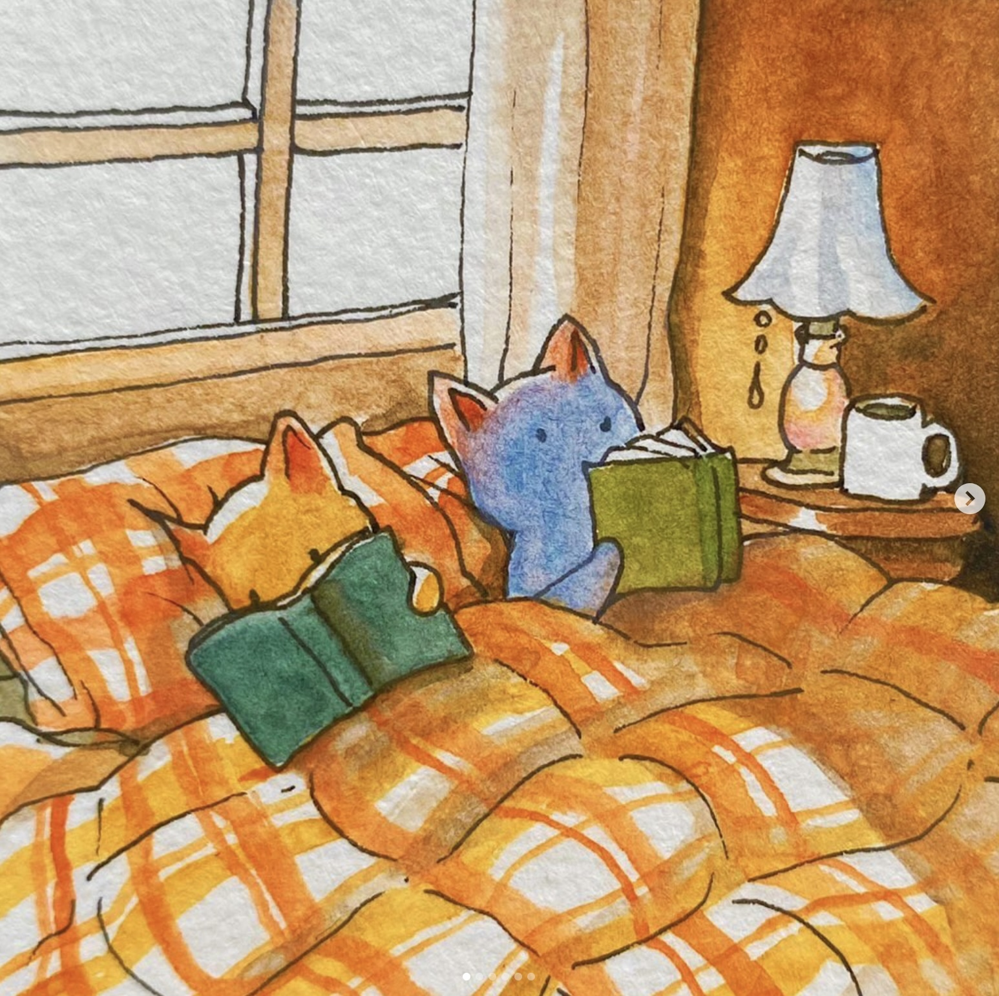
  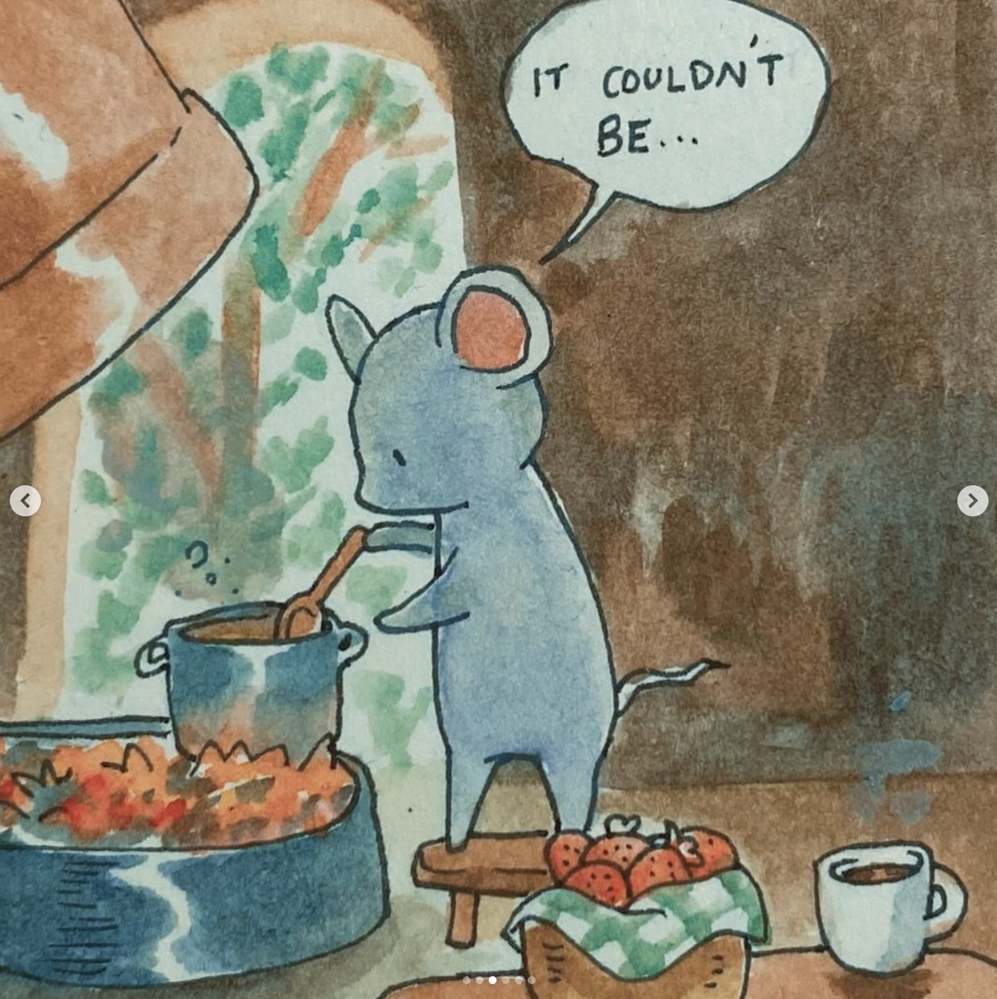 
  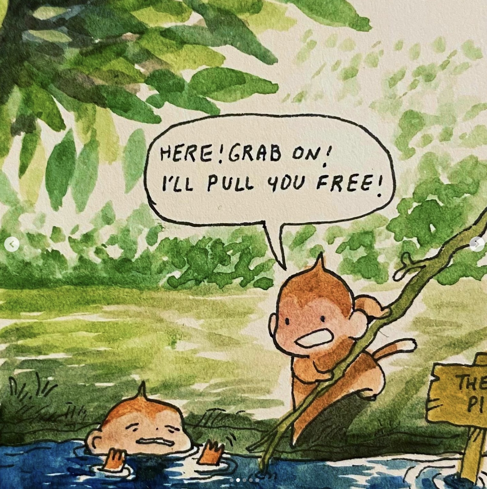
  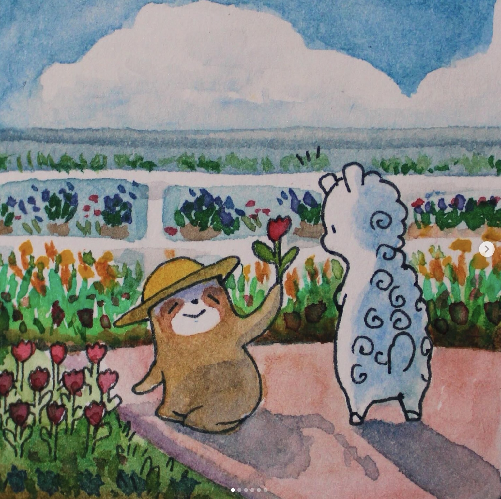
</p>

And here are some examples of outputs created by my model trying to generate similar scenes (TODO):

<p float="left">
  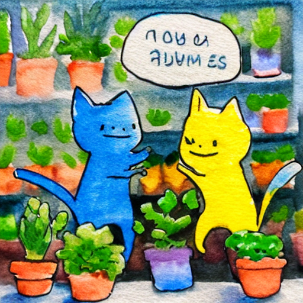
  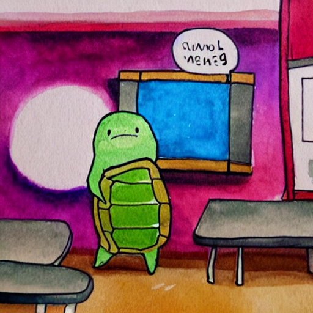 
  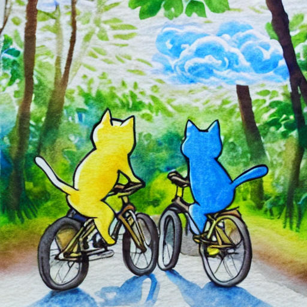
  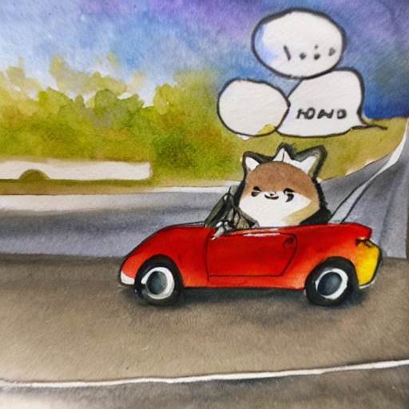
</p>

This pipeline was finetuned from **runwayml/stable-diffusion-v1-5** on the **omkar1799/annalaura-diffusion-dataset** dataset on Huggingface which I curated and annotated myself. I've included some example images generated 

## Stable Diffusion

Before starting to fine tune the model, I selected **runwayml/stable-diffusion-v1-5** as my foundation model and produced some outputs on a few prompts to see what it looks like out of the box. I'll recycle these prompts later for training validation and testing.

From left to right, the prompts are:
- blue and yellow cats shopping at plant store in an annalaura watercolor drawing style
- a turtle character dressed as teacher standing next to a chalkboard with equations on it in an annalaura watercolor drawing style
- blue and yellow cats riding bikes together through tropical forest path in an annalaura watercolor drawing style
- raccoon character wearing gold chain driving red sports car down highway in an annalaura watercolor drawing style

<p float="left">
  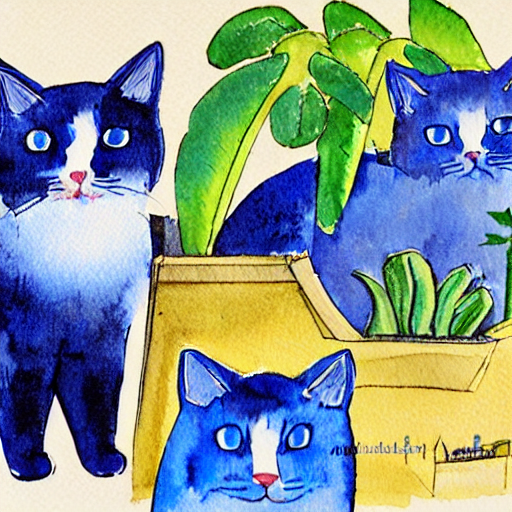
  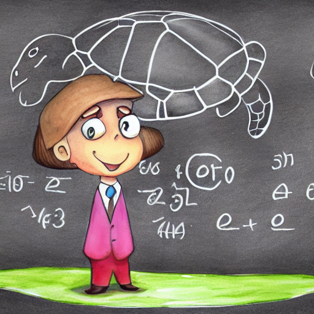 
  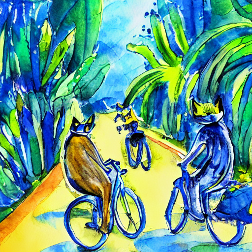
  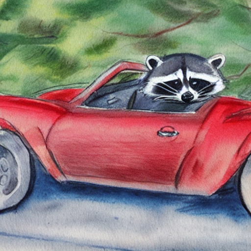
</p>

Unsurprisingly, Stable Diffusion did not do a great job of replicating Anna Laura's unique watercolor style, and furthermore failed to generalize well enough to produce animal-like characters that behaved like humans (i.e. it drew both a turtle and a teacher separately for the second prompt, instead of a single entity). 

## Preprocessing

To prepare my dataset for this training task, I needed both images and captions.

I used the Python `instaloader` package to quickly scrape specific posts off of the @annalaura_art Instagram account. You can find this script [here](./scraper.py). In total, I had about 850 images to work with as training examples.

Then, I wrote another script that fed these images to `claude-3.5-sonnet` and asked it to generate training data labels for each. In my prompt, I provided a few examples to guide it towards producing correct lables, and also set up a JSON formatter so I could easily pull these outputs into a dataframe later. Because of token limits per request, I only passed 10 images at a time. You can find that script [here](./labeler.py).

Lastly, I pulled associated these images and captions in a structured CSV using simple Pandas logic in a Jupyter notebook, which you can find [here](./preprocessing.ipynb).

I then submitted my dataset to Huggingface at **omkar1799/annalaura-diffusion-dataset** which can be found [here](https://huggingface.co/datasets/omkar1799/annalaura-diffusion-dataset).

## Training

To train this model, I was guided by a [tutorial](https://huggingface.co/docs/diffusers/v0.30.3/training/text2image?installation=PyTorch) published by Huggingface and used a jupyer notebook in Google Colab.

I tried using the script directly, but found that there were way too many options for configuration that I didn't need. I eventually ended up cutting out about half of it and keeping the other half for the actual training loop.

Some key tools used here were `accelerate` and `xformers` to speed up training time and reduce memory usage, respectively. Since I only have Colab Pro for hobbyists, it was really important I didn't exceed disk space. Also, I was only able to use 1 GPU at a time so I didn't get to enjoy any of the benefits of `accelerate` directly, but in the future if I got my hands on more machines I could. 

To tokenize the captions I used the CLIPTokenizer and for scheduling noise during the forward pass of training stable diffusion I used the DDPMScheduler.

At first, I trained the model with these key hyperparameters:
- Steps: 1,000
- Gradient accumulation steps: 4
- Batch size: 1
- Learning rate: 1e-05
- Mixed-precision: fp16

Here are the outputs at 1,000 steps against the same four prompts as before:

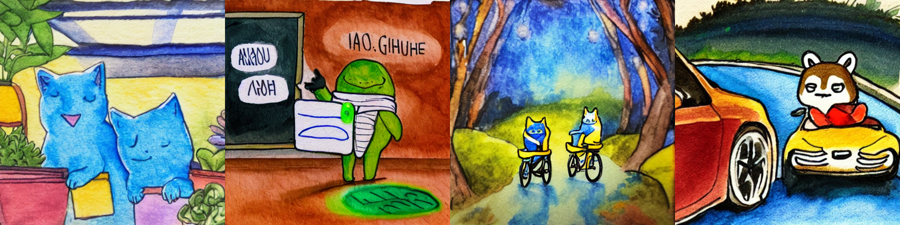

Definitely an improvement! It's starting to look like the model is understanding what "annalaura watercolor" style means, and is recognizing animals as humanoid entities. That being said, these outputs are still far from the end result I'd like to see, and it appears it has more to learn. 

So, here are the outputs at 5,000 steps with all the same hyperparameters against the same four prompts as before:

<p float="left">
  
   
  
  
</p>

Much better! There are definitely, some hallucinations (e.g. random letters in text bubbles), but the characters have taken on the shapes of Anna Laura's artwork and the model is doing a good job of generalizing to these similar but new prompts it hasn't seen before.

## Further improvements

If I had more time and access to compute, I'd do the following:
- Properly set up a training set and a validation set to check for overfitting. The tutorial script also had explanations for how to export metrics to either Weights & Biases or Tensorboard, so I could've used those tools to track loss over time.
- Train for more steps. Since I didn't actually measure training vs validation loss, I can't say for sure that the model didn't overfit, but if I had to guess it would do even better if I could train for 10,000 or even 15,000 steps. Unfortunately, Google Colab shuts off your connection to the GPU if it remains idle for more than a few hours so 5,000 steps was the feasible maximum with that constraint.
- Tune hyperparameters. I could've spun up multiple jobs at the same time to train at various learning rates and gradient accumulation steps and then compare results.

## Pipeline usage

You can use the pipeline like so:

```python
from diffusers import DiffusionPipeline
import torch

pipeline = DiffusionPipeline.from_pretrained("omkar1799/script-sd-annalaura-model", torch_dtype=torch.float16)
prompt = "blue and yellow cats shopping at plant store in an annalaura watercolor drawing style"
image = pipeline(prompt).images[0]
image.save("my_image.png")
```


